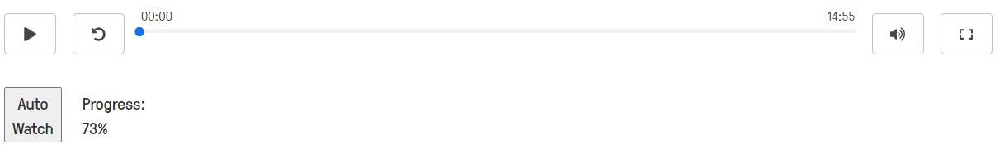

# watchEdpuzzle

An userscript which helps to auto-progress all the annoying assigned video. Gain your freedom and seize your day, watch whenever you want.

## Screenshot

## Usage

1. Install [Tampermonkey](https://chrome.google.com/webstore/detail/tampermonkey/dhdgffkkebhmkfjojejmpbldmpobfkfo)
2. Select the watchEdpuzzle.js script in this repository that you wish to use. View the file and click the Raw button at the top of the file to view its source code
3. Copy the whole source code
4. Open Tampermonkey in your browser and click the 'Add Script' tab (icon with a plus symbol)
5. Paste the source code into the script window and hit save
6. Open one of the unwatched assigned video and click the button below the progress bar, and the progress will slowly increase.

## Disclaimer

Please take note that this script does not provide answer to the edpuzzle question. I am not responsible for any consequences of using this script. This project is purely for academic exchange and personal hobby only. Please do not abuse it.
